# 阿里移动端电商用户行为分析

> 基于**阿里天池「阿里移动推荐算法」数据集**，完成电商用户行为全链路分析，包含 EDA 探索、转化漏斗、RFM 用户分层、AB-Test 仿真实验四大模块。

---

## 目录

- [项目背景](#项目背景)
- [数据集介绍](#数据集介绍)
- [数据预处理说明](#数据预处理说明)
- [模块1：EDA 探索性数据分析](#模块1eda-探索性数据分析)
- [模块2：电商转化漏斗分析](#模块2电商转化漏斗分析)
- [模块3：RFM 用户分层分析](#模块3rfm-用户分层分析)
- [模块4：AB-Test 仿真实验](#模块4ab-test-仿真实验)
- [综合业务洞察](#综合业务洞察)
- [业务优化建议](#业务优化建议)
- [数据局限性说明](#数据局限性说明)
- [项目目录结构](#项目目录结构)
- [运行方式](#运行方式)

---

## 项目背景

随着移动互联网电商的快速发展，用户行为数据的深度分析已成为平台精细化运营的核心能力。本项目基于阿里天池公开的移动端用户行为数据集，从**探索性数据分析（EDA）**出发，逐步深入到**转化漏斗分析**、**RFM 用户价值分层**，最终完成一套完整的 **AB-Test 仿真实验流程**。

项目旨在通过数据分析回答以下业务问题：
1. 用户在平台上的行为分布有何特征？时间维度上有何规律？
2. 从浏览到购买，用户在哪个环节流失最严重？
3. 如何识别高价值用户与流失风险用户？
4. 如何科学评估一个营销策略（如优惠券发放）的效果？

---

## 数据集介绍

| 属性 | 说明 |
|------|------|
| **数据来源** | 阿里天池「阿里移动推荐算法」数据集 |
| **时间范围** | 2014-11-18 ~ 2014-12-18（共31天） |
| **总记录数** | 12,256,906 条 |
| **独立用户数** | 10,000 人 |
| **独立商品数** | 2,876,947 个 |
| **独立类目数** | 8,916 个 |

**字段说明：**

| 字段 | 类型 | 说明 |
|------|------|------|
| `user_id` | int32 | 用户ID（脱敏） |
| `item_id` | int32 | 商品ID（脱敏） |
| `behavior_type` | int8 | 行为类型：1=浏览，2=收藏，3=加购，4=购买 |
| `item_category` | int32 | 商品类目ID |
| `time` | datetime | 行为发生时间（精确到小时） |
| `user_geohash` | string | 地理位置（已删除，大量空值且无法解析） |

---

## 数据预处理说明

1. **删除 `user_geohash` 列**：该列存在大量空值，且为加密哈希值，无法进行地理空间分析，予以删除。
2. **时间字段转换**：将 `time` 列转换为 `datetime` 类型，并衍生出以下字段：
   - `date`：日期（用于日维度趋势分析）
   - `hour`：小时（用于时段分布分析）
   - `day_of_week`：星期几（0=周一，6=周日）
   - `is_weekend`：是否为周末（用于工作日/周末对比）
3. **行为类型映射**：将数字编码映射为中文标签（浏览/收藏/加购/购买），便于可视化展示。
4. **内存优化**：使用 `int32`、`int8` 等低内存 dtype 加载 633MB 数据文件，提升加载效率。
5. **空值处理**：删除 `time` 字段为空的异常记录。

---

## 模块1：EDA 探索性数据分析

### 1.1 基础统计

| 指标 | 数值 |
|------|------|
| 总行为记录数 | 12,256,906 |
| 独立用户数 | 10,000 |
| 独立商品数 | 2,876,947 |
| 独立类目数 | 8,916 |

**各类行为数量与占比：**

| 行为类型 | 记录数 | 占比 |
|----------|--------|------|
| 浏览 | 11,550,581 | 94.24% |
| 收藏 | 242,556 | 1.98% |
| 加购 | 343,564 | 2.80% |
| 购买 | 120,205 | 0.98% |

> 浏览行为占据绝对主导地位（94.24%），购买行为仅占 0.98%，体现了电商用户行为**高度稀疏**的特征。

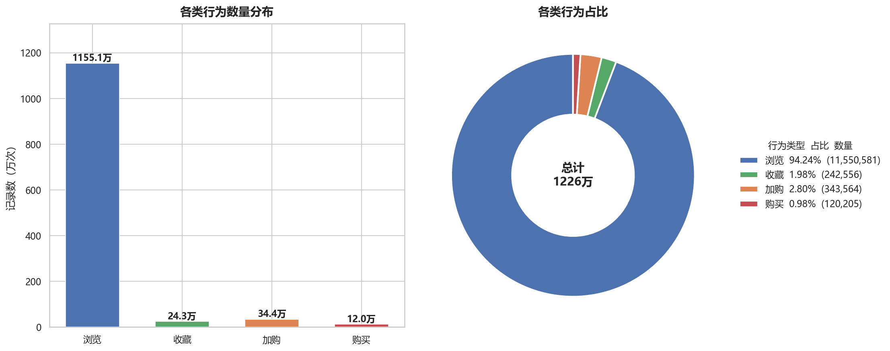

### 1.2 时间维度分析

**日 UV 与日行为总量趋势：**

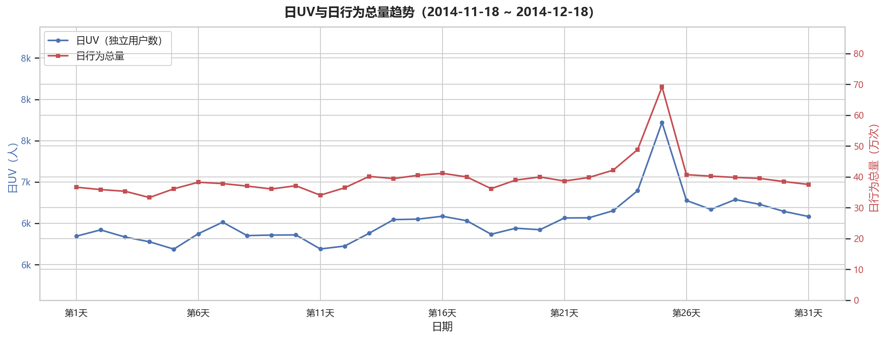

**工作日 vs 周末日均行为对比：**

- 工作日天数：23天，周末天数：8天
- 工作日日均浏览 374,585 次，周末日均浏览 366,891 次
- 整体来看，工作日与周末的日均行为量差异不大，周末略低

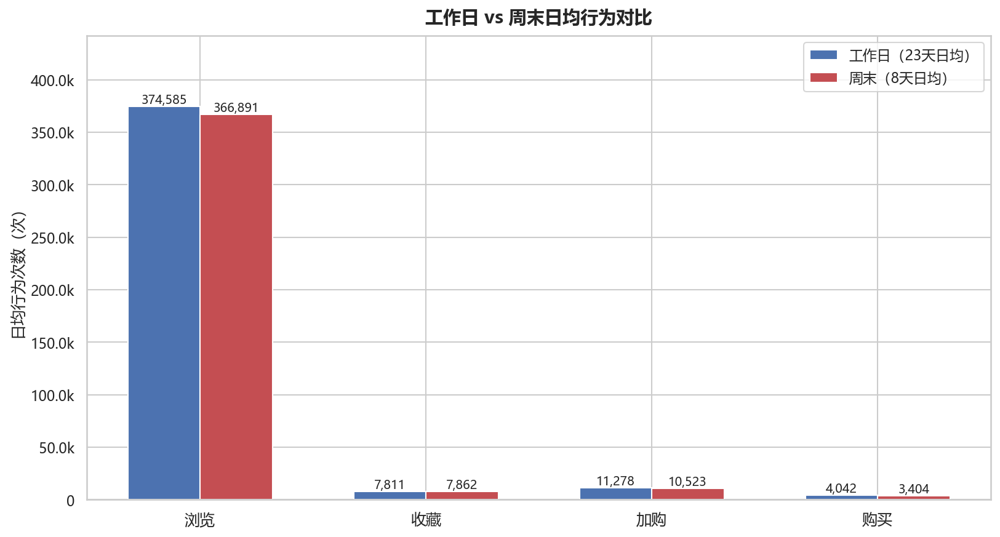

**24 小时行为分布：**

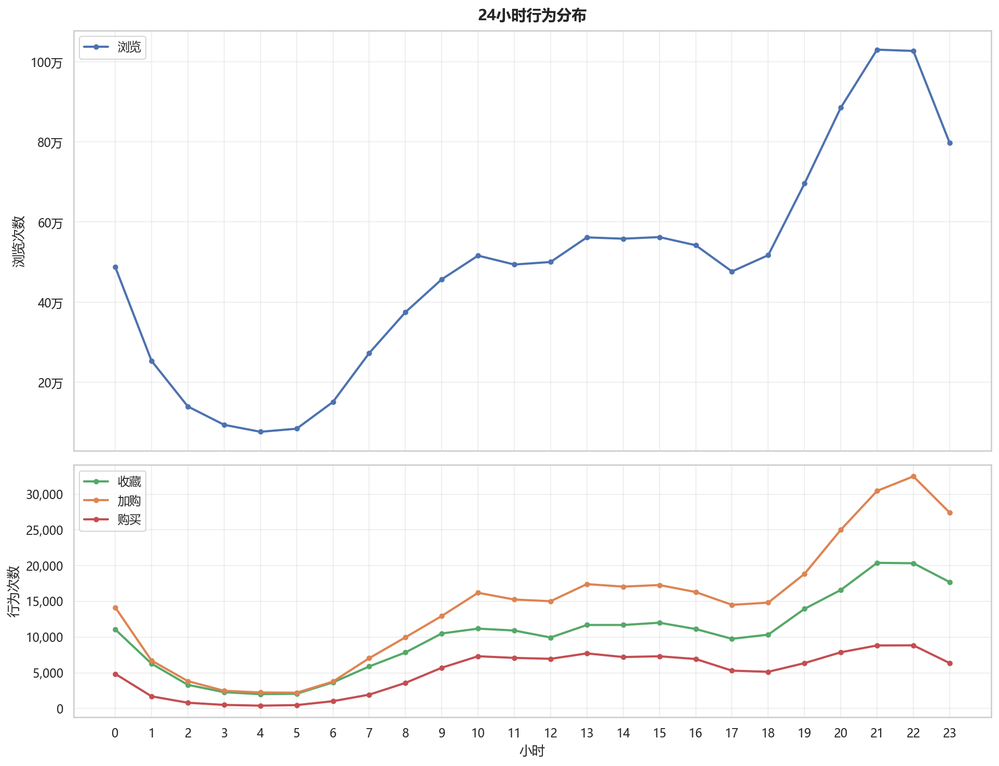

> 从小时分布来看，用户行为在晚间（20-23点）和午间（11-13点）出现高峰，凌晨（2-6点）为低谷，符合典型移动互联网用户的作息规律。

### 1.3 类目分析

**Top 20 类目行为分布：**

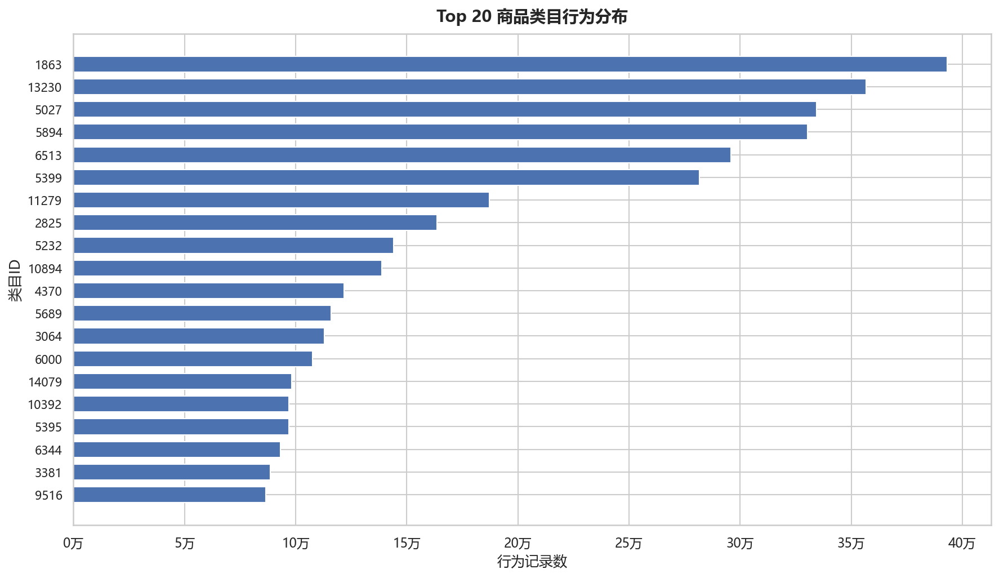

**Top 20 类目购买次数分布：**

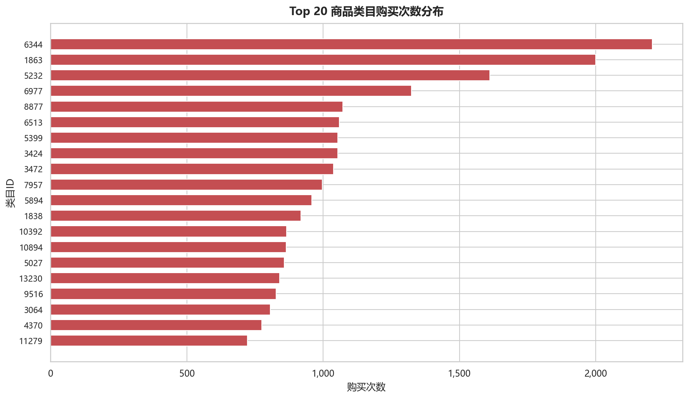

> 类目 ID 1863 在总行为数和购买数上均位居前列，属于平台核心类目。值得注意的是，总行为数 Top 类目与购买数 Top 类目并不完全重合，说明部分类目虽然浏览量大但转化效率较低。

---

## 模块2：电商转化漏斗分析

### 业务路径

**浏览 → 收藏 → 加购 → 购买**

> ⚠️ **重要口径**：漏斗每一步统计**去重独立 user_id（用户粒度）**，不统计行为记录条数。

### 漏斗统计结果

| 步骤 | 用户数 | 步骤转化率 | 流失率 | 总体转化率 |
|------|--------|------------|--------|------------|
| 浏览 | 10,000 | 100.0% | 0.0% | 100.0% |
| 收藏 | 6,730 | 67.3% | 32.7% | 67.3% |
| 加购 | 6,020 | 89.45% | 10.55% | 60.2% |
| 购买 | 5,739 | 95.33% | 4.67% | 57.39% |

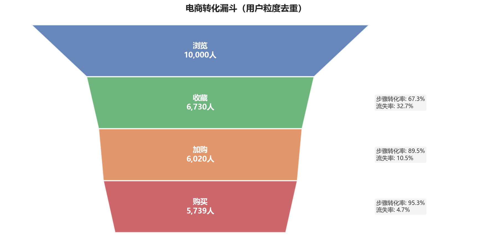

### 流失节点分析

| 流失节点 | 流失人数 | 流失率 | 业务解读 |
|----------|----------|--------|----------|
| 浏览→收藏 | 3,270 | 32.7% | **主要流失节点**。超过三成用户浏览后未产生收藏行为，用户从"被动浏览"到"主动意向"的转化存在较大阻力 |
| 收藏→加购 | 710 | 10.5% | 流失相对较小，已有收藏行为的用户转化意愿较强 |
| 加购→购买 | 281 | 4.7% | 流失最小，加购用户购买意愿明确，转化效率高 |

**整体转化率**：浏览→购买 = **57.39%**

> **关键发现**：浏览→收藏是最大的流失节点（32.7%），说明用户在浏览阶段的"兴趣激发"环节存在显著瓶颈。相比之下，收藏→加购和加购→购买的流失率均较低，表明一旦用户产生了明确的购买意向（收藏行为），后续转化路径较为顺畅。

---

## 模块3：RFM 用户分层分析

### ⚠️ 数据妥协说明

> **数据集没有消费金额 M（Monetary）**，本分析使用**用户购买频次替代 M 指标**。这是在数据局限性下的妥协处理，报告中必须写明该替代方案。

### RFM 指标定义

| 指标 | 定义 | 说明 |
|------|------|------|
| R（Recency） | 用户最近一次购买距离数据集最后一天 2014-12-18 的间隔天数 | R 值越小，用户越活跃 |
| F（Frequency） | 用户总的购买行为次数 | F 值越大，用户购买越频繁 |
| M（Monetary） | **复用购买频次作为替代** | 原始数据集无消费金额字段 |

### RFM 分箱打分

采用五分位分箱法，将 R 和 F 各分为 5 个等级（1-5 分）：
- **R_score**：R_days 越小（最近购买）分数越高，5分为最近购买用户
- **F_score**：F 越大（购买越多）分数越高，5分为高频购买用户
- **M_score**：复用 F_score（因 M 指标由 F 替代）

### 用户分层结果

以 R_score 和 F_score 的均值为阈值，将用户分为五个群体：

| 用户分层 | 用户数 | 占比 | R均值（天） | F均值（次） | 业务特征 |
|----------|--------|------|-------------|-------------|----------|
| 高价值用户 | 2,805 | 28.05% | -0.2 | 24.7 | 近期有购买且购买频次高，是平台核心用户 |
| 潜力用户 | 789 | 7.89% | -0.0 | 3.8 | 近期有购买但频次低，有提升空间 |
| 一般用户 | 2,526 | 25.26% | 5.5 | 15.7 | 购买频次较高但近期活跃度下降 |
| 流失用户 | 2,766 | 27.66% | 10.7 | 3.0 | 购买频次低且距上次购买时间久 |
| 无购买用户 | 1,114 | 11.14% | — | 0 | 从未产生购买行为 |

> 注：R均值为负数表示用户在 2014-12-18 当天有购买行为，即数据集最后一天仍在活跃。

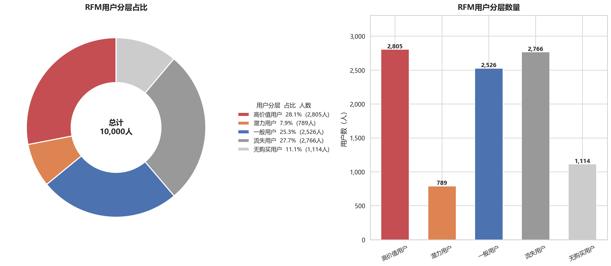

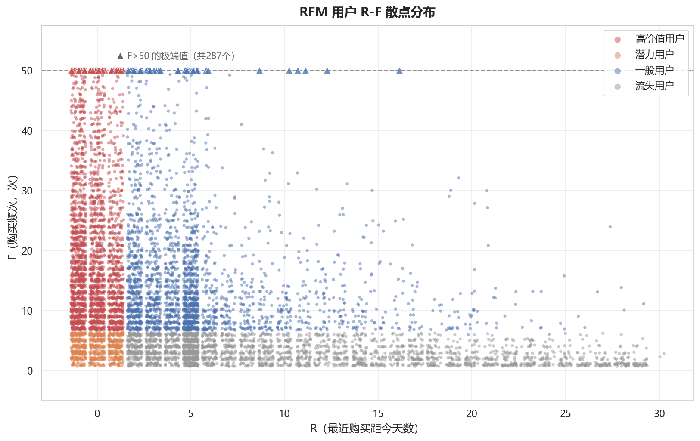

### 各群体业务解读

- **高价值用户（28.05%）**：R 均值接近 0（当天购买）、F 均值 24.7 次，是平台最核心的用户群体，应重点维护，提供 VIP 服务与个性化推荐。
- **潜力用户（7.89%）**：近期有购买但频次低（F=3.8），处于成长期，适合通过优惠券、推荐引导提升购买频次。
- **一般用户（25.26%）**：购买频次尚可（F=15.7）但 R 值偏高（5.5天），活跃度有所下降，需通过召回活动重新激活。
- **流失用户（27.66%）**：R 值最高（10.7天）、F 值最低（3.0），已处于流失边缘，需评估召回成本与价值。
- **无购买用户（11.14%）**：从未购买，需分析其浏览行为特征，设计首购激励策略。

---

## 模块4：AB-Test 仿真实验

> **⚠️ 本数据集没有真实线上 AB 分组，以下为基于历史用户的仿真实验，仅用于演示完整 AB 测试流程，不是真实业务实验结果。**

### 4.1 实验设计

**业务假设**：模拟上线优惠券营销活动，将全部 10,000 个 user_id 随机拆分为两组：
- **对照组（control）**：5,000 人，不发放优惠券
- **实验组（treatment）**：5,000 人，发放优惠券

> 拆分原则：按 user_id 整体随机拆分，一个用户只能归属一组，不拆分用户的行为。

### 4.2 SRM 样本比例校验

| 指标 | 数值 |
|------|------|
| 对照组用户数 | 5,000 |
| 实验组用户数 | 5,000 |
| 卡方统计量 | 0.0000 |
| p 值 | 1.0000 |

> p > 0.05，分流比例符合 50%:50%，无样本比例失衡（SRM）问题。

### 4.3 仿真模拟

从实验组未购买用户中，随机选取部分用户"转化"为购买用户，模拟 3% 的相对转化提升：
- 实验组仿真前购买用户：4,429
- 仿真新增购买用户：161
- 实验组仿真后购买用户：4,590

### 4.4 转化率计算

| 指标 | 对照组 | 实验组 |
|------|--------|--------|
| 购买用户数 | 4,457 | 4,590 |
| 总用户数 | 5,000 | 5,000 |
| 转化率 | 89.14% | 91.80% |

| 差异指标 | 数值 |
|----------|------|
| 绝对差异（abs diff） | 2.6600 个百分点 |
| 相对提升（rel lift） | 2.98% |

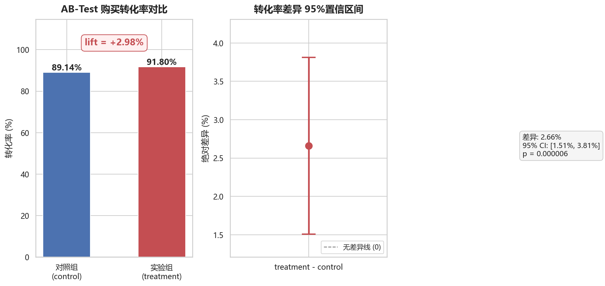

### 4.5 两样本比例 Z 检验

| 检验指标 | 数值 |
|----------|------|
| 合并转化率 p_pool | 90.47% |
| 标准误 SE | 0.005873 |
| Z 统计量 | 4.5295 |
| p 值 | 0.000006 |
| 95% 置信区间 | [1.5090%, 3.8110%] |

> p < 0.05，拒绝原假设 H0，两组转化率差异**统计显著**。95% 置信区间不包含 0，进一步确认正向效应。

### 4.6 MDE 最小可检测效应

**样本量公式（两样本比例检验）：**

$$
n = \frac{(Z_{\alpha/2} + Z_{\beta})^2 \cdot 2p(1-p)}{\Delta^2}
$$

**参数说明：**
- **Zα/2 = 1.96**：显著性水平 α=0.05 双侧检验的标准正态分位数，表示拒绝域的临界值。α 越小，Zα/2 越大，对差异的判定越严格。
- **Zβ = 0.84**：统计功效 1-β=80% 对应的标准正态分位数。β 为二类错误概率（漏检真实效应的概率），Zβ 越大，功效越高，越不容易遗漏真实差异。
- **p**：基准转化率（对照组转化率）
- **Δ**：待检测的最小转化率差异（MDE）

**反推 MDE：**

$$
MDE = (Z_{\alpha/2} + Z_{\beta}) \cdot \sqrt{\frac{2p(1-p)}{n}}
$$

| 参数 | 数值 |
|------|------|
| 显著性水平 α | 0.05（Zα/2 = 1.96） |
| 统计功效 1-β | 0.80（Zβ = 0.84） |
| 基准转化率 p | 89.14% |
| 每组样本量 n | 5,000 |
| **绝对 MDE** | **1.7424 个百分点** |
| **相对 MDE** | **1.95%** |
| 实际相对 lift | 2.98% |

> 实际 lift（2.98%）> 相对 MDE（1.95%），效应可被检测到。

**统计显著 vs 业务显著的区别：**
- **统计显著**：p 值 < 0.05，说明观察到的差异不太可能由随机波动引起。它回答的是"差异是否真实存在"。
- **业务显著**：差异的幅度是否达到业务可接受的最小阈值。它回答的是"差异是否值得行动"。
- 本实验中 lift=2.98%，属于仿真设定的小幅提升。在真实业务中，需结合 ROI、优惠券成本、长期用户留存等综合判断业务显著性。一个统计显著的微小提升，如果优惠券成本过高，可能并不具备业务显著性。

### 4.7 AA 空转仿真

**原理**：不施加任何策略，随机拆分两组进行 Z 检验，重复 1000 次后统计 p<0.05 的比例。理论上，在 α=0.05 下，约 5% 的 AA 测试会出现假阳性（一类错误）。

| 指标 | 数值 |
|------|------|
| AA 测试次数 | 1,000 |
| p<0.05 的次数 | 48 |
| **一类错误率（实验值）** | **0.0480** |
| 理论值 α | 0.05 |

> 实验值 0.0480 接近理论值 0.05，说明实验框架无系统性偏差，分流与检验逻辑正确。

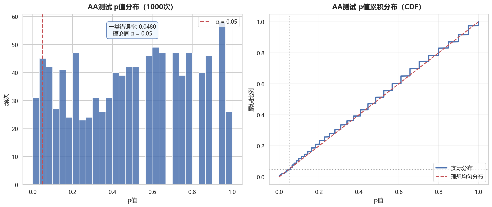

### 4.8 仿真场景下的业务决策结论

1. 仿真设定实验组获得 **2.98%** 的相对转化提升。
2. Z 检验 p 值 = 0.000006 < 0.05，差异**统计显著**。
3. 95% 置信区间 [1.5090%, 3.8110%] 不包含 0，确认正向效应。
4. 当前样本量下 MDE 为 1.74 个百分点（相对 1.95%），实际 lift 2.98% > MDE，效应可被检测。
5. AA 测试一类错误率 = 0.048，接近理论值 0.05，实验框架可靠。
6. **决策建议**：在仿真场景下，优惠券策略带来统计显著的转化提升。真实业务中需进一步验证：ROI 是否为正、优惠券成本是否可控、长期用户留存影响、是否存在用户疲劳效应等。

---

## 综合业务洞察

### 1. 用户行为高度稀疏

平台 12,256,906 条行为记录中，浏览占比高达 94.24%，购买仅占 0.98%。这表明绝大多数用户行为停留在浏览阶段，深层次互动（收藏、加购、购买）的渗透率有待提升。

### 2. 漏斗核心瓶颈在"兴趣激发"环节

浏览→收藏的流失率高达 32.7%，是转化漏斗中最大的流失节点。相比之下，收藏→加购（10.5%）和加购→购买（4.7%）的流失率较低。这说明用户一旦产生明确购买意向，后续转化较为顺畅，瓶颈在于如何将"被动浏览"转化为"主动兴趣"。

### 3. 用户价值分化明显

RFM 分析显示，高价值用户占 28.05%（R值接近0、F均值24.7次），流失用户占 27.66%（R值10.7天、F均值3.0次）。两个群体规模接近，但价值贡献差异巨大，需要差异化的运营策略。

### 4. 时间维度存在运营窗口

用户行为在晚间 20-23 点达到高峰，午间 11-13 点为次高峰。工作日与周末的日均行为量差异不大，说明用户的消费习惯较为稳定，可在高峰时段加大推荐力度。

### 5. AB-Test 框架验证可靠

AA 测试一类错误率（0.048）接近理论值（0.05），证明实验框架的分流逻辑和统计检验方法正确可靠，可用于后续真实实验的评估。

---

## 业务优化建议

### 1. 优化浏览→收藏的转化路径

- **个性化推荐升级**：基于用户浏览历史，在浏览页面增加"猜你喜欢"模块，提高商品曝光精准度。
- **内容化运营**：增加商品详情页的内容丰富度（图文、视频、用户评价），延长用户停留时间，激发收藏意愿。
- **快捷收藏入口**：在浏览列表页增加一键收藏按钮，降低操作门槛。

### 2. 高价值用户深度运营

- **VIP 专属权益**：为高价值用户（28.05%）提供专属折扣、优先发货、免费退换等特权。
- **个性化推荐**：基于购买频次高的特征，构建精准推荐模型，提升复购率。
- **会员积分体系**：建立积分/等级体系，增强用户粘性。

### 3. 流失用户召回策略

- **分阶段召回**：对一般用户（活跃度下降）推送限时优惠；对流失用户发送召回优惠券。
- **召回成本控制**：流失用户 F 均值仅 3.0 次，需评估单用户召回成本与预期 LTV 的比值，避免无效投入。
- **精准触达**：在晚间 20-23 点高峰时段推送召回消息，提高触达效率。

### 4. 无购买用户首购激励

- **新客专享优惠**：为 11.14% 的无购买用户提供首单立减、免邮等激励。
- **浏览行为分析**：分析无购买用户的浏览类目偏好，推送对应品类的促销信息。
- **降低决策门槛**：提供免费试用、不满意退款等保障，降低首次购买的心理门槛。

### 5. AB-Test 实验体系建议

- **建立常态化实验机制**：将 AB-Test 框架应用于所有策略上线前的评估，确保决策的数据驱动。
- **关注业务显著性**：不仅关注统计显著性（p值），更要评估业务显著性（ROI、成本效益）。
- **长期效果监控**：避免仅关注短期转化提升，需持续监控用户留存、LTV 等长期指标。

---

## 数据局限性说明

> 以下数据局限性贯穿全部分析模块，解读结论时需充分考虑：

1. **数据来源与时间范围**：数据来源于阿里天池「阿里移动推荐算法」数据集，时间范围为 **2014-11-18 ~ 2014-12-18**，仅覆盖 31 天，无法反映长期趋势和季节性特征。

2. **RFM 模型 M 维度替代**：**数据集没有订单消费金额，RFM 模型 M 维度采用购买频次做替代**。这使得 M 指标与 F 指标完全相同，无法区分"高频低额"与"高频高额"用户，用户分层的精细度受限。

3. **AB-Test 为仿真模拟**：**AB-Test 章节属于仿真模拟，并非真实线上实验**。实验组的效果提升是通过随机选取未购买用户"转化"为购买用户来模拟的，不反映真实业务干预的因果效应。

4. **漏斗统计口径**：漏斗采用**用户粒度**统计，统计去重 `user_id`，不是原始行为条数。漏斗步骤采用嵌套逻辑（每步为前一步的子集），用户必须依次经历所有前置步骤才被计入后续步骤。

5. **用户行为高度稀疏**：绝大多数用户只有浏览没有购买（行为分布中浏览占 94.24%，购买仅占 0.98%）。无用户画像信息（年龄、性别、地域等）、无会话信息（session），无法进行用户路径分析和会话级归因。

---

## 项目目录结构

```
alibaba_ecommerce_analysis/
├── data
│   └── tianchi_mobile_recommend_train_user.csv   # 阿里天池数据集（633MB）
├── img                                            # 所有输出图表
│   ├── 01_behavior_distribution.png              # 行为类型分布
│   ├── 02_daily_trend.png                         # 日UV与日行为总量趋势
│   ├── 03_weekday_weekend.png                     # 工作日vs周末对比
│   ├── 04_hourly_distribution.png                # 24小时行为分布
│   ├── 05_top_categories.png                     # Top20类目行为分布
│   ├── 06_top_purchase_categories.png            # Top20类目购买分布
│   ├── 07_funnel_chart.png                       # 转化漏斗图
│   ├── 08_rfm_segment.png                        # RFM用户分层
│   ├── 09_rfm_scatter.png                        # RFM散点分布
│   ├── 10_abtest_conversion.png                  # AB-Test转化率对比
│   └── 11_aa_test.png                            # AA测试p值分布
├── main.ipynb                                     # 完整分析notebook
├── main.py                                        # 完整分析脚本（命令行运行）
├── README.md                                      # 项目报告（本文档）
└── requirements.txt                               # 依赖包列表
```

---

## 运行方式

### 环境要求

- Python 3.8+
- 依赖包见 `requirements.txt`

### 安装依赖

```bash
pip install -r requirements.txt
```

### 运行分析

**方式一：运行 Python 脚本**

```bash
python main.py
```

**方式二：运行 Jupyter Notebook**

```bash
jupyter notebook main.ipynb
```

### 数据文件准备

将 `tianchi_mobile_recommend_train_user.csv` 放置于 `data/` 目录下，确保路径与代码中 `DATA_PATH` 一致。

---

## 技术栈

| 库 | 用途 |
|----|------|
| pandas | 数据加载、清洗、聚合 |
| numpy | 数值计算 |
| matplotlib | 图表绘制 |
| seaborn | 统计可视化 |
| scipy | 统计检验（Z检验、卡方检验） |

---

## 作者

本项目用于学习与求职作品展示，基于阿里天池公开数据集完成。
